# Business Transformation AI — Implementation Audit & Master Improvement Plan

**Repository:** `https://github.com/Aryan-B-Parikh/business-transformation-ai`  
**Basis:** `01_PRD.md`, `02_TECHNICAL_ARCHITECTURE.md`, `03_DATA_MODEL.md`, `04_API_SPEC.md`, `05_AGENT_TASK_BACKLOG.md`  
**Status:** Approved Architectural Baseline — Execution Active

---

## 1. Approved Architectural Baseline & Core Commitments

1. **Domain Aggregate Repositories**: Repositories encapsulate cohesive domain aggregates (`ProjectAggregateRepository`, `ArtifactAggregateRepository`, `DocumentAggregateRepository`, `TransformationAggregateRepository`, `CollaborationAggregateRepository`, `WebhookAggregateRepository`, `GovernanceAggregateRepository`) rather than artificial 1:1 table CRUD wrappers.
2. **Transaction-Scoped Parameterized RLS**: Enforce tenant isolation via parameterized `SELECT set_config('app.current_org_id', $1, true);` (where `is_local = true` guarantees transaction scope). Validated using pooled, non-superuser PostgreSQL connections to ensure no cross-connection state leakage.
3. **Fail-Fast Production Startup**: `NODE_ENV=production` strictly enforces `STORAGE_BACKEND=postgres`, valid `DATABASE_URL`, and production secrets. No silent fallback to in-memory persistence.
4. **Transactional Outbox & Deep SSRF Defense**: Domain state mutations and webhook event emissions are committed atomically in the same database transaction. Webhook delivery performs pre-resolution DNS checks covering IPv4/IPv6, `0.0.0.0/8`, link-local, CGNAT (`100.64.0.0/10`), IPv4-mapped IPv6, and re-validates every resolved destination across redirects.
5. **Sandboxed Static Parsing**: Untrusted source code repositories, archives, and documents undergo AST/lexical static parsing with strict file count, uncompressed size, symlink, and timeout guards. No submitted code is ever executed.
6. **Persistent 12-Stage Transformation Journey**: Database-backed stage tracking (`idea` -> `discovery` -> `business_analysis` -> `solution_design` -> `architecture` -> `process_design` -> `ux_design` -> `data_design` -> `planning` -> `review` -> `approved` -> `implementation`) with transition validation, revision rollbacks, and audit logging.
7. **Versioned Mathematical Scoring & Traceability**: All dashboard maturity, readiness, and risk formulas include explicit versioning (`formula_version: "v1.0"`), dimensional weights, and source evidence for reproducibility.
8. **Real Binary Exports**: Production document generation (`pdfkit`, `docx`, `exceljs`, `pptxgenjs`) with vector/SVG diagram rendering, structured layout validation, and automated parser/content tests.
9. **End-to-End Golden Path Acceptance**: Comprehensive automated test validating the complete lifecycle from Organization creation to multi-format binary export against real infrastructure.
10. **Shared Contracts & Invariants**: All API, Web, Mobile, AI, and persistence boundaries use versioned schemas and a common error/validation contract (`packages/shared/src/contracts/`). Production invariants enforce tenant isolation, authorization, idempotency, auditability, configuration validation, and deterministic artifact/version handling.

---

## 2. 18-Phase Master Execution Roadmap

```mermaid
graph TD
    P0[Phase 0: Baseline Architecture & Shared Contracts] --> P1[Phase 1: Prisma Domain Repositories & RLS Hardening]
    P1 --> P2[Phase 2: Auth, JWT Key Rotation & RBAC Matrix]
    P2 --> P3[Phase 3: Storage, Secure Parser Worker & Citation RAG]
    P3 --> P4[Phase 4: Transactional Outbox & Async Workers]
    P4 --> P5[Phase 5: Real Binary Exports PDF/DOCX/XLSX/PPTX]
    P5 --> P6[Phase 6: Durable Webhooks & DNS-Rebinding SSRF Security]
    P6 --> P7[Phase 7: AI Schemas, Repair Loop & Persistent Journey]
    P7 --> P8[Phase 8: Deep AI Blueprint Engines HLD/LLD/BPMN/UX/ER]
    P8 --> P9[Phase 9: Deep Existing Application Assessment Engine]
    P9 --> P10[Phase 10: Versioned Data-Driven Dashboard & Maturity Models]
    P10 --> P11[Phase 11: Web Frontend Complete API & State Integration]
    P11 --> P12[Phase 12: Collaboration, Approvals & Scoped Feeds]
    P12 --> P13[Phase 13: Enterprise Admin, Governance & Token Budgets]
    P13 --> P14[Phase 14: Real React Native / Expo Mobile Application]
    P14 --> P15[Phase 15: Security Hardening, Observability & DR]
    P15 --> P16[Phase 16: Concurrency, Performance SLOs & Load Testing]
    P16 --> P17[Phase 17: Golden Path E2E & Final PRD Acceptance Gate]
```

---

## 3. Implementation Log & Active Steps

- **Baseline Status**: Test suite passing across monorepo packages.
- **Architectural Baseline**: Approved.
- **Current Step**: Executing **Phase 0** (Shared Contracts & Repository Aggregate Interfaces) and **Phase 1** (Prisma Domain Repositories, Parameterized Transaction RLS, and Fail-Fast Production Startup Guard).
